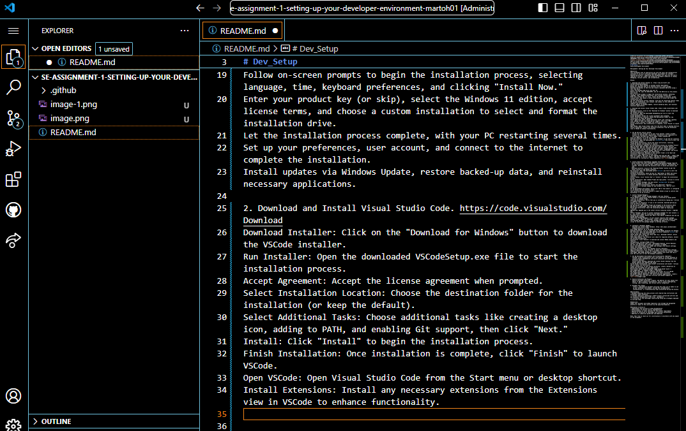
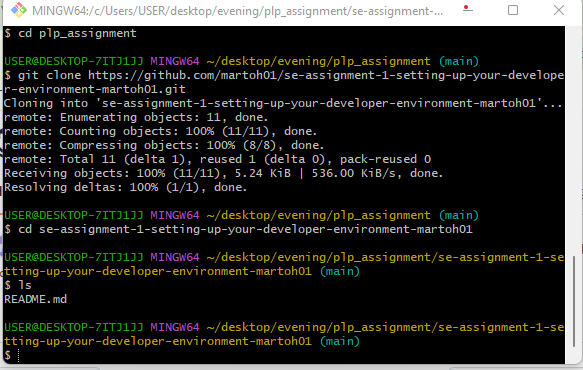
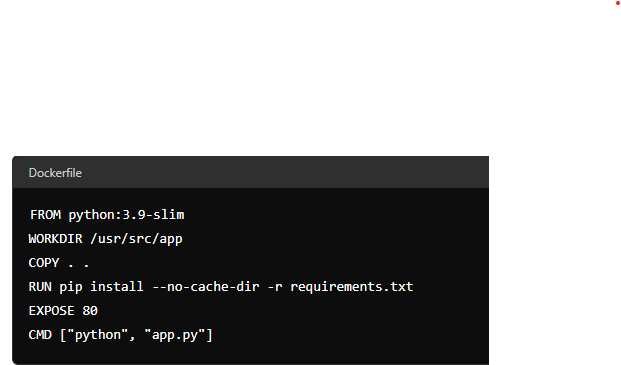

# Dev_Setup
Setup Development Environment

#Assignment: Setting Up Your Developer Environment

#Objective:
This assignment aims to familiarize you with the tools and configurations necessary to set up an efficient developer environment for software engineering projects. Completing this assignment will give you the skills required to set up a robust and productive workspace conducive to coding, debugging, version control, and collaboration.

#Tasks:

1. Download and Install Windows 11. https://www.microsoft.com/software-download/windows11
Ensure your PC meets Windows 11 minimum system requirements.
Backup all important data to an external drive or cloud storage.
Download the Windows 11 ISO file and create a bootable USB drive using a tool like Rufus.
Insert the bootable USB drive into your PC.
Restart your PC, open the BIOS/UEFI, and set the USB drive as the primary boot device.
Follow on-screen prompts to begin the installation process, selecting language, time, keyboard preferences, and clicking "Install Now."
Enter your product key (or skip), select the Windows 11 edition, accept license terms, and choose a custom installation to select and format the installation drive.
Let the installation process complete, with your PC restarting several times.
Set up your preferences, user account, and connect to the internet to complete the installation.
Install updates via Windows Update, restore backed-up data, and reinstall necessary applications.

2. Download and Install Visual Studio Code. https://code.visualstudio.com/Download
Download Installer: Click on the "Download for Windows" button to download the VSCode installer.
Run Installer: Open the downloaded VSCodeSetup.exe file to start the installation process.
Accept Agreement: Accept the license agreement when prompted.
Select Installation Location: Choose the destination folder for the installation (or keep the default).
Select Additional Tasks: Choose additional tasks like creating a desktop icon, adding to PATH, and enabling Git support, then click "Next."
Install: Click "Install" to begin the installation process.
Finish Installation: Once installation is complete, click "Finish" to launch VSCode.
Open VSCode: Open Visual Studio Code from the Start menu or desktop shortcut.
Install Extensions: Install any necessary extensions from the Extensions view in VSCode to enhance functionality.

3. Set Up Version Control System:
   Install Git and configure it on your local machine. Create a GitHub account for hosting your repositories. Initialize a Git repository for your project and make your first commit. https://github.com
Visit Git Website: Go to the Git website.
Download Installer: Click on "Download for Windows" to get the Git installer.
Run Installer: Open the downloaded Git-<version>-<bit>.exe file to start the installation process.
Follow Setup Instructions: Follow the setup instructions, selecting preferred options (use defaults if unsure).
Finish Installation: Complete the installation process by clicking "Finish."
Open Git Bash: Open Git Bash from the Start menu or desktop shortcut.
Configure Git: Set your username and email with git config --global user.name "Your Name" and git config --global user.email "you@example.com".
Create GitHub Account: Visit GitHub, sign up for a new account, and follow the instructions to complete the registration.
Initialize Repository: Navigate to your project folder in Git Bash and initialize a Git repository with git init.
Make First Commit: Add files to the staging area with git add ., commit them with git commit -m "Initial commit", and push to GitHub following GitHub's instructions for setting up a remote repository.

4. Install Necessary Programming Languages and Runtimes:
  Instal Python from http://wwww.python.org programming language required for your project and install their respective compilers, interpreters, or runtimes. Ensure you have the necessary tools to build and execute your code.
  Download Installer: Click on the "Download Python" button to get the latest version of the Python installer.
Run Installer: Open the downloaded python-<version>.exe file to start the installation process.
Customize Installation: Check the box for "Add Python to PATH" and select "Customize installation" to choose optional features and installation location.
Install Python: Click "Install Now" or "Install" to begin the installation process.
Verify Installation: Open Command Prompt and type python --version to verify the installation.
Install Necessary Packages: Use pip install <package_name> to install required packages for your project.
Install Compilers/Interpreters: Install any additional compilers, interpreters, or runtimes needed for your project (e.g., GCC for C/C++ extensions).
Set Up Development Environment: Ensure your IDE or text editor is configured to use Python and the necessary tools.
Test Installation: Write and execute a simple Python script to confirm that everything is set up correctly.

5. Install Package Managers:
   If applicable, install package managers like pip (Python).
Verify Python Installation: Ensure Python is installed by typing python --version in Command Prompt.
Check pip Installation: Verify that pip is installed by typing pip --version in Command Prompt.
Install pip (if necessary): If pip is not installed, download get-pip.py from the official website.
Run get-pip.py: Open Command Prompt and navigate to the directory where get-pip.py is downloaded, then run python get-pip.py to install pip.
Verify pip Installation: Check the installation again by typing pip --version.
Upgrade pip: Upgrade pip to the latest version using pip install --upgrade pip.
Install Packages: Use pip to install necessary packages for your project, e.g., pip install numpy for installing the NumPy package.
Configure Environment: Ensure your IDE or text editor recognizes pip and can manage Python packages.
Check Other Package Managers: If your project requires other package managers (e.g., conda for Anaconda), install them following similar steps.
Test Package Manager: Install a test package and import it in a Python script to confirm the package manager is working correctly.

6. Configure a Database (MySQL):
   Download and install MySQL database. https://dev.mysql.com/downloads/windows/installer/5.7.html
Visit MySQL Website: Go to the MySQL download page.
Download Installer: Click on "Download" for the MySQL Installer for Windows.
Run Installer: Open the downloaded mysql-installer-community-<version>.msi file to start the installation process.
Choose Setup Type: Select the setup type (e.g., Developer Default, Server only, Full) and click "Next."
Check Requirements: The installer will check for required software. Install any missing prerequisites.
Installation: Click "Execute" to download and install MySQL products and features.
Configuration: Configure MySQL Server:
Choose a configuration type (e.g., Development Machine, Server Machine).
Set the root password and create user accounts if needed.
Select the default MySQL port (3306) and configure the network settings.
Choose the authentication method.
Configure the MySQL server as a Windows service (optional).
Apply Configuration: Click "Execute" to apply the configuration settings.
Complete Installation: Finish the installation process by clicking "Finish."
Test MySQL: Open MySQL Workbench or MySQL Command Line Client and log in with the root user to test the database connection.

7. Set Up Development Environments and Virtualization (Optional):
   Consider using virtualization tools like Docker or virtual machines to isolate project dependencies and ensure consistent environments across different machines.
   Install Docker Desktop: Download and install Docker Desktop from the Docker website and complete the setup.
Verify Docker Installation: Check Docker installation with docker --version and run docker run hello-world.
Create a Dockerfile: In your project directory, create a Dockerfile to define the environment for your application.
Build Docker Image: Build the Docker image using docker build -t your-image-name . in Command Prompt or PowerShell.
Run Docker Container: Start a container with docker run -d -p 80:80 your-image-name and access the application at http://localhost.
Use Docker Compose (Optional): For multi-container applications, create a docker-compose.yml file and start services with docker-compose up.

8. Explore Extensions and Plugins:
   Explore available extensions, plugins, and add-ons for your chosen text editor or IDE to enhance functionality, such as syntax highlighting, linting, code formatting, and version control integration.

9. Document Your Setup:
    Create a comprehensive document outlining the steps you've taken to set up your developer environment. Include any configurations, customizations, or troubleshooting steps encountered during the process. 

#Deliverables:
- Document detailing the setup process with step-by-step instructions and screenshots where necessary.
- A GitHub repository containing a sample project initialized with Git and any necessary configuration files (e.g., .gitignore).
- A reflection on the challenges faced during setup and strategies employed to overcome them.

#Submission:
Submit your document and GitHub repository link through the designated platform or email to the instructor by the specified deadline.

#Evaluation Criteria:**
- Completeness and accuracy of setup documentation.
- Effectiveness of version control implementation.
- Appropriateness of tools selected for the project requirements.
- Clarity of reflection on challenges and solutions encountered.
- Adherence to submission guidelines and deadlines.

Note: Feel free to reach out for clarification or assistance with any aspect of the assignment.
